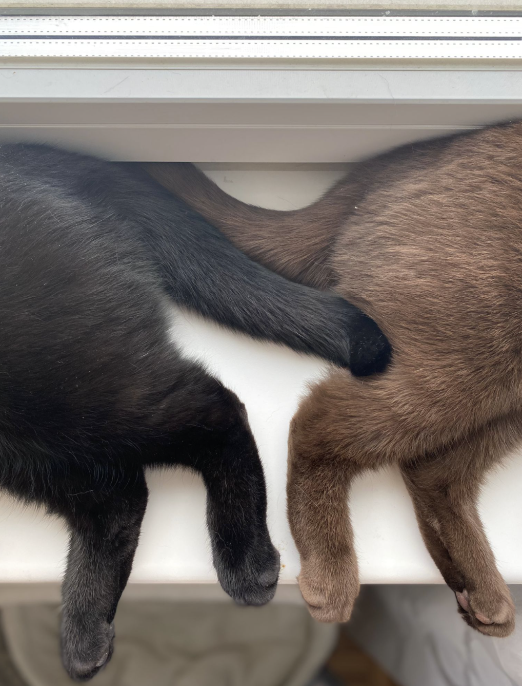
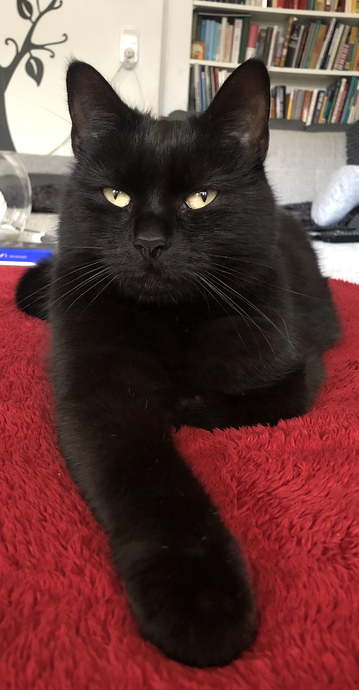
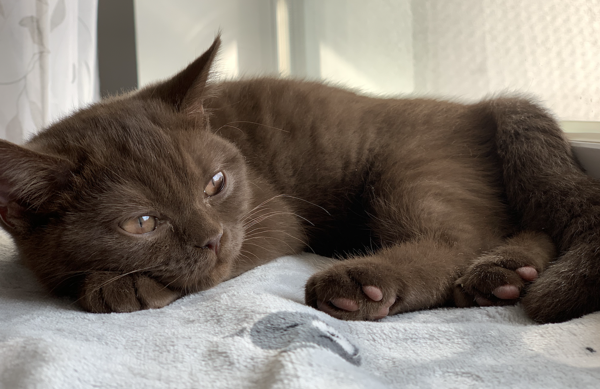
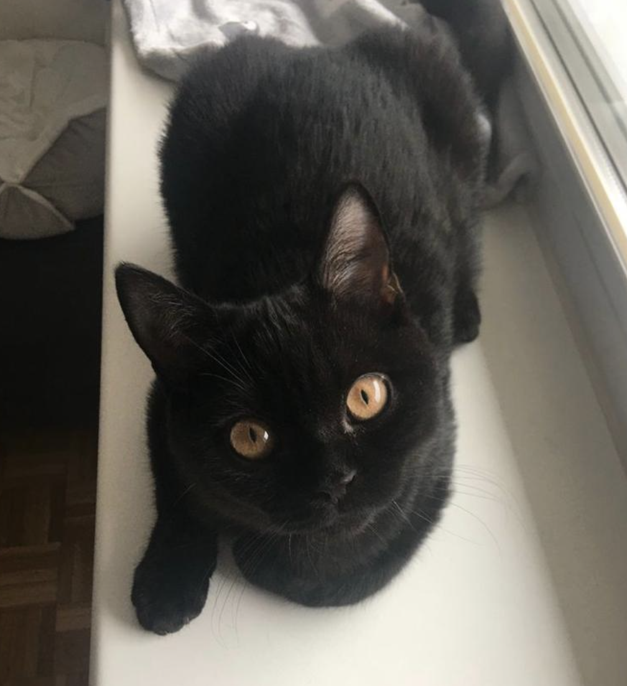

# Cats

## Facts about my cats
I have 3 cats. Their names are Narla (9 years), Mila and Milo (1 year). Mila and Milo are siblings. They are all inseparable. 
Narla and Milo are both black and Mila is brown. Mila and Milo are british shorthair cats.

## What do my cats eat?
* Dreamies
* Leandro
* Mjam Mjam
* Macs
* Mice (if they catch some)

All these foods are healthy for the cats with no wheat or sugar added. 
You can check out the website <https://www.zooplus.at> if you like! 

## How are their characters?
* Narla:
  * shy around people she does not know
  * active
  * cuddly
  * well-behaved
  * clever
  * loves to get picked up

* Mila
  * tired
  * active but loves her peace and quite
  * well-behaved
  * playful
  * shy
  * quickly annoyed
  * hates it when you touch her face or pick her up

* Milo
  * naughty
  * stubborn
  * needs constant attention
  * active
  * playful
  * loves food
  * cuddly

## How do they look like?
This is Narla.

This is Mila.
 

This is Milo!

