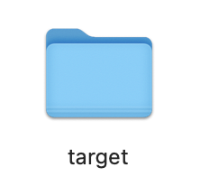
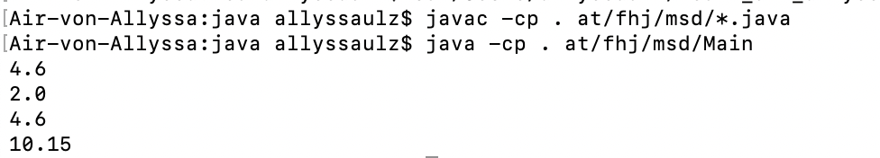

# Exercise3

## Arbeitsschritte

* Umgebungsvariable festgelegt
* Calculator Klasse und Main Klasse erstellt und im Package gespeichert
* Nach der ersten Ausführung wurde ein Target Ordner erstellt

## Ausführen des Projektes in der Konsole

## Hochladen auf GitHub

