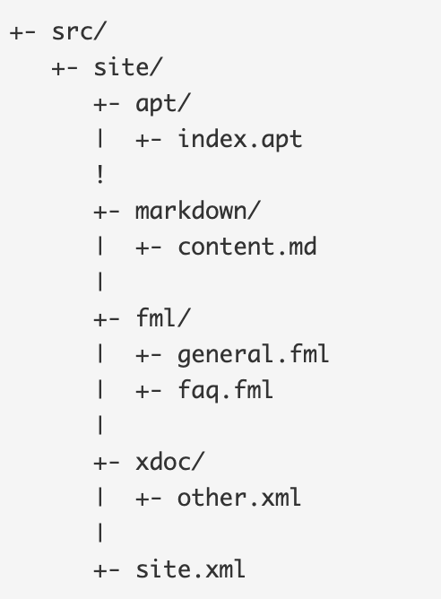

# Documentation

## What is necessary to generate a Maven site documentation?

## What different aspects, configurations, information, etc are configured in site.xml or pom.xml?

A Project Object Model or POM is the fundamental unit of work in Maven. It is an XML file that contains information about the project and configuration details used by Maven to build the project. It contains default values for most projects. Examples for this is the build directory, which is target; the source directory, which is src/main/java; the test source directory, which is src/test/java; and so on. When executing a task or goal, Maven looks for the POM in the current directory. It reads the POM, gets the needed configuration information, then executes the goal.

Some of the configuration that can be specified in the POM are the project dependencies, the plugins or goals that can be executed, the build profiles, and so on. Other information such as the project version, description, developers, mailing lists and such can also be specified.

